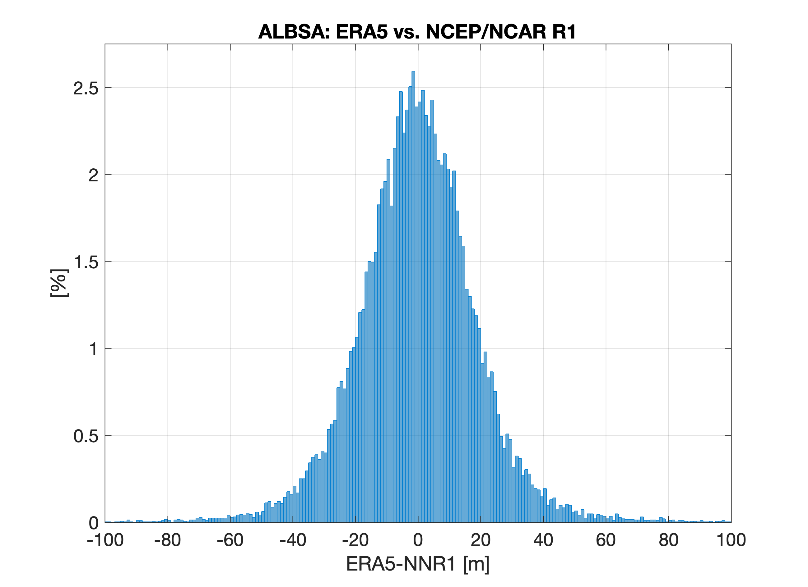

# Create ALBSA index data set

Create a NetCDF4 file containing daily calculations of the ALBSA index.
ALBSA: "Aleutian Low - Beaufort Sea Anticyclone" (Cox et al., 2019)
It is a 4-pt index on the geopotential height field a 850 hPa where the points are 
   North (“N” at 75°N/170°W), 
   South (“S” at 50°N/170°W), 
   East (“E” at 55°N/150°W), and 
   West (“W” at 55°N/160°E)

   ALBSA = ( E-W ) - ( N - S ) and is expressed in meters of GPH

The index has been most commonly defined based on the NCEP/NCAR Reanalysis 1, but in depreciation this routine calculates ALBSA using the ECMWF ERA5 reanalysis.
Testing in May 2025 shows differences between the reanalyses of mean -0.24 m, std 19.5 m, averaged for all days overlapping 1948-2025 (n = 28259). The mean
absolute value of the error variance is ~0.035%. This code handles the download from ECMWF, the calculation, and the writes the new NetCDF.
A histogram of the differences:

  

## References and Acknowledgement 

The product is generated using Copernicus Climate Change Service information (CCCS/CDS, 2023). 
 ECMWF Reanalysis v5 (ERA5) (Hersbach, et al. 2020; Hersbach et al., 2023)

Copernicus Climate Change Service, Climate Data Store, (2023): ERA5 hourly data on pressure levels from 1940 to present. 
   Copernicus Climate Change Service (C3S) Climate Data Store (CDS), [DOI:10.243381/cds.bd0915c6](https://doi.org/10.24381/cds.bd0915c6)

Cox, C. J., R. S. Stone, D. C. Douglas, D. M. Stanitski, and D. C. Douglas (2019), The Aleutian Low - 
  Beaufort Sea Anticyclone: A climate index correlated with the timing of springtime melt in the
  Pacific Arctic cryosphere. Geophysical Research Letters, 46(13), 7464-7473, 
  [DOI:10.1029/2019GL083306](https://doi.org/10.1029/2019GL083306)

Hersbach, H., B. Bell, P. Berrisford, G. Biavati, A. Horányi, J. Muñoz Sabater, J. Nicolas, C. Peubey, C., 
   R. Radu, I. Rozum, D. Schepers, A. Simmons, C. Soci, D. Dee, and J.-N. Thépaut (2023): ERA5 hourly data on 
   pressure levels from 1940 to present. Copernicus Climate Change Service (C3S) Climate Data Store (CDS), 
   [DOI:10.24381/cds.bd0915c6](https://doi.org/10.24381/cds.bd0915c6)

Hersbach, H., B. Bell, P. Berrisford, S. Hirahara, A. Horányi, J. Muñoz-Sabater, J. Nicolas, C. Peubey, 
   R.Radu, D. Schepers, A. Simmons, C. Soci, S. Abdalla, X. Abellan, G. Balsamo, P. Bechtold, G. Biavati, 
   J. Bidlot, M. Bonavita, G. De Chiara, P. Dahlgren, D. Dee, M. Diamantakis, R. Dragani, J. Flemming, 
   R. Forbes, M. Fuentes, A. Geer, L. Haimberger, S. Healy, R. J. Hogan, E. Hólm, M. Janisková, S. Keeley, 
   P. Laloyaux, P. Lopez, C. Lupu, G. Radnoti, P. de Rosnay, I. Rozum, F. Vamborg, S. Villaume, and J.-N. Thépaut 
   (2020) The ERA5 global reanalysis. Quarterly Journal of the Royal Meteorological Society, 146(730), 1999-2049,
   [DOI:10.1002/qj.3803](https://doi.org/10.1002/qj.3803)

## Purpose

The code will be run annually, most likely in early June (ALBSA is most useful September - May) and the output file will replace the previous one at the Arctic Data Center. 
The data DOI will remain the same 

## Getting started

1. Checkout the code form this repository, including
2. Read this README and the code documentation

## Code description: 

How to run:
python3 ./calc_albsa.py -p /path/to/working/directory/ -s 1940 -e 2025

Arguments:
-p: path to working directory (REQUIRED)
-s: starting year for the desired file contents (OPTIONAL; default to 1940)
-e: ending year for the desired file contents (OPTIONAL; default to current year)

## Required software:

The following python packages are required, noting the tested versions

~~~
python  ≥ 3.13.2
netCDF4 ≥ 1.7.2
xarray ≥ 2024.11.0
cdsapi ≥ 0.7.6
~~~

## Author

* Christopher J. Cox (NOAA/PSL) - <christopher.j.cox@noaa.gov>

## License

See LICENSE.txt