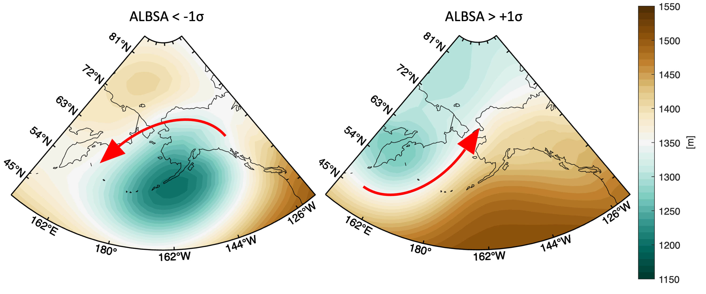

# Create ALBSA index data set

Creates a NetCDF4 file containing daily calculations of the "Aleutian Low - Beaufort Sea Anticyclone" (Cox et al., 2019).
ALBSA is a 4-pt index on the geopotential height field a 850 hPa where the points are 
   North (“N” at 75°N/170°W), 
   South (“S” at 50°N/170°W), 
   East (“E” at 55°N/150°W), and 
   West (“W” at 55°N/160°E)

   ALBSA = ( E-W ) - ( N - S ) and is expressed in meters of GPH. The mean state of the wintertime (September - May) positive and negative values are as follows:

  

The index has been most commonly defined based on the NCEP/NCAR Reanalysis 1, but in depreciation this routine calculates ALBSA using the ECMWF ERA5 reanalysis.
Testing in May 2025 shows differences between the reanalyses of mean -0.24 m, std 19.5 m, averaged for all days overlapping 1948-2025 (n = 28259). The mean
absolute value of the error variance is ~0.035%. This code handles the download from ECMWF, the calculation, and the writes the new NetCDF.
A histogram of the differences:

  

## References and Acknowledgement 

The product is generated using Copernicus Climate Change Service information (CCCS/CDS, 2023). 
 ECMWF Reanalysis v5 (ERA5) (Hersbach, et al. 2020; Hersbach et al., 2023)

Copernicus Climate Change Service, Climate Data Store, (2023): ERA5 hourly data on pressure levels from 1940 to present. 
   Copernicus Climate Change Service (C3S) Climate Data Store (CDS), [DOI:10.243381/cds.bd0915c6](https://doi.org/10.24381/cds.bd0915c6)

Cox, C. J., R. S. Stone, D. C. Douglas, D. M. Stanitski, and M. R. Gallagher (2019), The Aleutian Low - 
  Beaufort Sea Anticyclone: A climate index correlated with the timing of springtime melt in the
  Pacific Arctic cryosphere. Geophysical Research Letters, 46(13), 7464-7473, 
  [DOI:10.1029/2019GL083306](https://doi.org/10.1029/2019GL083306)

Hersbach, H., B. Bell, P. Berrisford, G. Biavati, A. Horányi, J. Muñoz Sabater, J. Nicolas, C. Peubey, C., 
   R. Radu, I. Rozum, D. Schepers, A. Simmons, C. Soci, D. Dee, and J.-N. Thépaut (2023): ERA5 hourly data on 
   pressure levels from 1940 to present. Copernicus Climate Change Service (C3S) Climate Data Store (CDS), 
   [DOI:10.24381/cds.bd0915c6](https://doi.org/10.24381/cds.bd0915c6)

Hersbach, H., B. Bell, P. Berrisford, S. Hirahara, A. Horányi, J. Muñoz-Sabater, J. Nicolas, C. Peubey, 
   R.Radu, D. Schepers, A. Simmons, C. Soci, S. Abdalla, X. Abellan, G. Balsamo, P. Bechtold, G. Biavati, 
   J. Bidlot, M. Bonavita, G. De Chiara, P. Dahlgren, D. Dee, M. Diamantakis, R. Dragani, J. Flemming, 
   R. Forbes, M. Fuentes, A. Geer, L. Haimberger, S. Healy, R. J. Hogan, E. Hólm, M. Janisková, S. Keeley, 
   P. Laloyaux, P. Lopez, C. Lupu, G. Radnoti, P. de Rosnay, I. Rozum, F. Vamborg, S. Villaume, and J.-N. Thépaut 
   (2020) The ERA5 global reanalysis. Quarterly Journal of the Royal Meteorological Society, 146(730), 1999-2049,
   [DOI:10.1002/qj.3803](https://doi.org/10.1002/qj.3803)

Note on Modifications: The original API boilerplate logic (CC BY 4.0) modified to meet the needs of this project.

## Purpose

The code will be run annually, most likely in early June (ALBSA is most useful September - May) and the output file will replace the previous one at the Arctic Data Center. 
The data DOI will remain the same 

## Getting started

1. Checkout the code form this repository, including
2. Read this README and the code documentation

## Code description: 

How to run:
python3 ./calc_albsa.py -p /path/to/working/directory/ -s 1940 -e 2025

Arguments:
-p: path to working directory (REQUIRED)
-s: starting year for the desired file contents (OPTIONAL; default to 1940)
-e: ending year for the desired file contents (OPTIONAL; default to current year)

## Required software:

The following python packages are required, noting the tested versions

~~~
python  ≥ 3.13.2
netCDF4 ≥ 1.7.2
xarray ≥ 2024.11.0
cdsapi ≥ 0.7.6
~~~

## Author

* Christopher J. Cox (NOAA/PSL) - <christopher.j.cox@noaa.gov>

## License

Copyright 2025 U.S. Federal Government (in countries where recognized)

Please refer to the [LICENSE](./LICENSE.txt), [NOTICE](./NOTICE.txt), and [INTENT](./INTENT.txt) files for details.

## Disclaimer

This repository is a scientific product and is not official communication of the National Oceanic and Atmospheric Administration, or the United States Department of Commerce. All NOAA GitHub project code is provided on an 'as is' basis and the user assumes responsibility for its use. Any claims against the Department of Commerce or Department of Commerce bureaus stemming from the use of this GitHub project will be governed by all applicable Federal law. Any reference to specific commercial products, processes, or services by service mark, trademark, manufacturer, or otherwise, does not constitute or imply their endorsement, recommendation or favoring by the Department of Commerce. The Department of Commerce seal and logo, or the seal and logo of a DOC bureau, shall not be used in any manner to imply endorsement of any commercial product or activity by DOC or the United States Government.